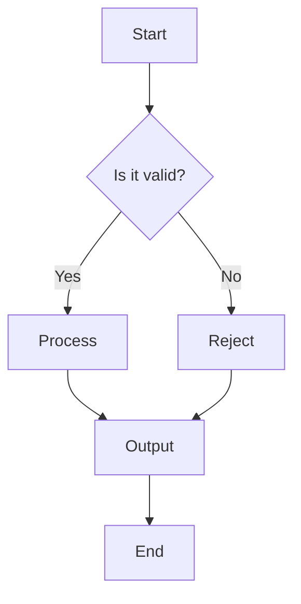
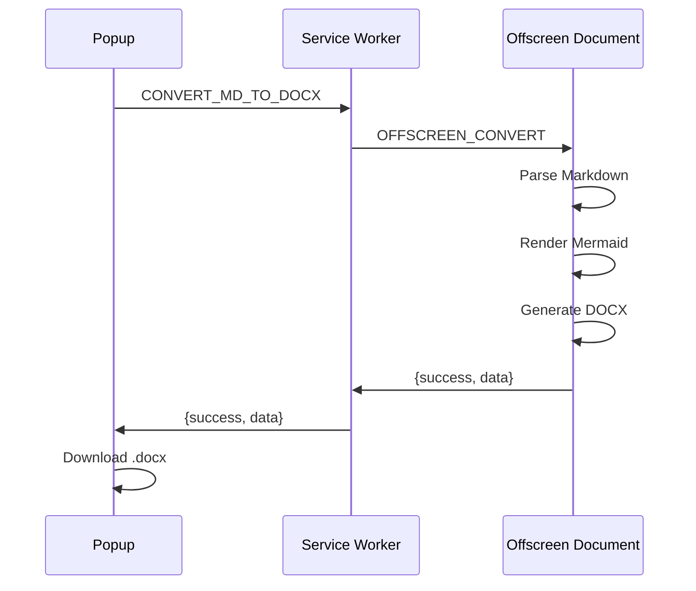

# markdocx Integration Test

This document exercises all features supported by the markdocx converter.

## Text Formatting

This paragraph contains **bold text**, *italic text*, ***bold italic***, and `inline code`. It also has a [link](https://example.com).

## Headings

### Third Level

#### Fourth Level

##### Fifth Level

## Lists

### Unordered List

- First item
- Second item with **bold**
  - Nested item A
  - Nested item B
- Third item with `inline code`

### Ordered List

1. Step one
2. Step two
   1. Sub-step 2a
   2. Sub-step 2b
3. Step three

## Blockquote

> This is a blockquote with **bold** and *italic* text.
> It can span multiple lines.

## Horizontal Rule

---

## Code Blocks

### JavaScript

```javascript
function greet(name) {
  const message = `Hello, ${name}!`;
  console.log(message);
  return message;
}

greet('markdocx');
```

### Python

```python
def fibonacci(n: int) -> list[int]:
    """Generate Fibonacci sequence."""
    seq = [0, 1]
    for i in range(2, n):
        seq.append(seq[i-1] + seq[i-2])
    return seq[:n]

print(fibonacci(10))
```

### Plain Text

```text
This is a plain text block.
No language badge should appear.
```

## Tables

### Simple Table

| Feature | CLI | Extension |
|---------|-----|-----------|
| Markdown parsing | markdown-it | markdown-it |
| Mermaid rendering | mmdc + Puppeteer | mermaid.render() + Canvas |
| DOCX generation | html-to-docx | html-to-docx (polyfilled) |
| Image support | fs.readFile | Directory picker |

### Table with Colspan

| Category | Details |
|----------|---------|
| Platform | Node.js 22+ (CLI), Chrome MV3 (Extension) |
| License | MIT |

## Local Image


## Mermaid Diagrams

### Flowchart



### Sequence Diagram



## Edge Cases

### Empty Code Block

```
```

### Single-Line Code Block

```bash
echo "hello"
```

### Table in Blockquote Context

> Note: The extension requires a directory picker for local images.

### Special Characters

Angle brackets: `<div>` and `</div>`

Ampersand: `R&D`

Quotes: "double" and 'single'
