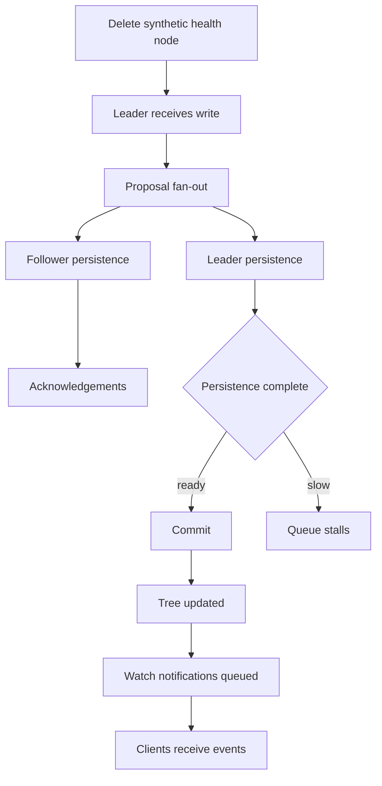
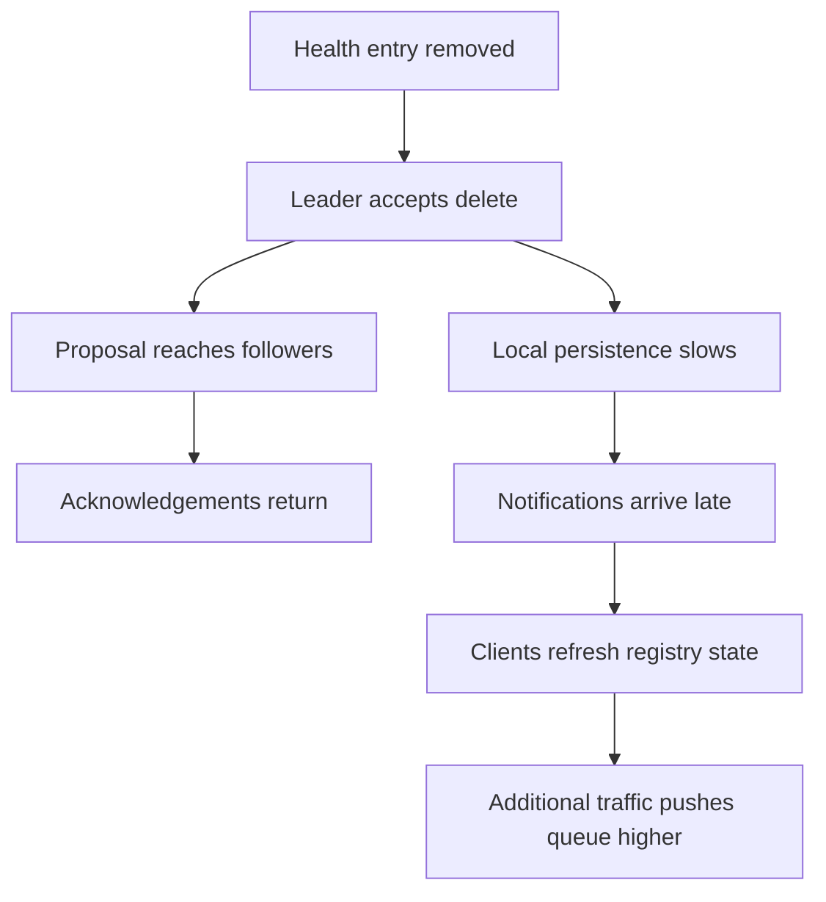
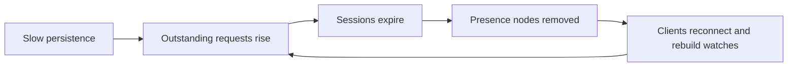

# Coordination Service Incident Review

This backup fixture is intentionally desensitized for future publication. It mirrors the public-safe structure used by the main incident markdown and contains no original dates, exact registry keys, infrastructure identifiers, or raw measurements.

## Context

The cluster is a generic coordination service used by many clients across multiple zones. Some hosts use one storage profile while other hosts use another storage profile. Clients rely on a reconnecting SDK that restores watches and refreshes registry state after session loss.

## Synthetic Registry Layout

- Service metadata path: `/registry/services/<group>/<service>`
- Capability metadata path: `/registry/capabilities/<group>/<service>/<feature>`
- Presence path: `/registry/presence/<group>/<service>/<release>/<instance>`
- Health path: `/registry/health/<instance>`
- Route map path: `/registry/routes/<group>/<service>/<release>/<feature>/<channel>/<instance>`

## Generic Failure Pattern

An operator removed synthetic health entries while the cluster was already under strain. The SDK ignored those health-node deletions directly, but the coordination layer still had to persist the writes and deliver notifications. That extra work delayed queue drain, pushed sessions into expiry, and caused presence-node cleanup. Presence cleanup then triggered watch rebuilds and refresh traffic from clients.

> The content in this file is a public-safe surrogate. It is intended to preserve markdown rendering coverage only.

## Internal Processing Diagram



## Recovery Escalation Diagram



## Recovery Loop Diagram



## Qualitative Observations

| Topic | Public-safe wording |
| --- | --- |
| Queue behavior | Request depth rose faster than it could drain |
| Storage behavior | Persistence latency became unpredictable |
| Session behavior | Many clients expired close together |
| Client behavior | Recovery traffic amplified server pressure |
| Operational lesson | Safe deletion workflows need cluster-aware guardrails |

## Simplified Example Code

```python
def rebuild_watch_state(client, root_path, watcher_factory):
    client.ensure_session()

    for branch in client.list_children(root_path):
        client.watch_children(branch, watcher_factory("branch"))
        for leaf in client.list_children(branch):
            client.watch_data(leaf, watcher_factory("leaf"))

    return "watch-state-rebuilt"
```

## Publication Guidance

- Keep path examples generic.
- Remove concrete dates and environment counts.
- Replace measured values with qualitative descriptions.
- Avoid exposing real cluster topology or naming conventions.
- Preserve only the engineering lesson, not the production fingerprint.
