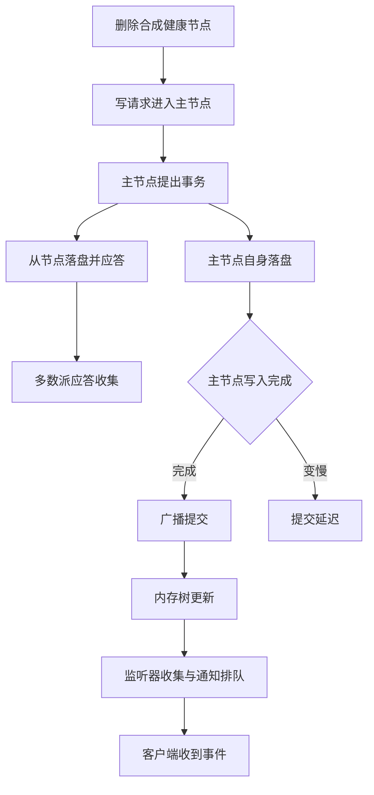

# 协调服务事故分析报告（脱敏示例）

这份文档是面向未来开源仓库准备的脱敏样例。它保留了原始材料的结构特征，例如长段落、表格、代码块、Mermaid 图和路径样式，但移除了真实日期、真实键名、真实环境拓扑、真实容量值以及任何直接可回溯到内部系统的数字信息。

## 背景

某协调服务集群承载了大量客户端注册、监听与恢复逻辑。集群跨越多个区域，底层存储特征并不一致，客户端又集中偏向部分区域访问，因此在稳态下虽然可以工作，但在异常写入与恢复流量叠加时容易出现放大效应。

这份脱敏文档只保留工程层面的结论：

- 共享写路径一旦变慢，提交链路会被拖住
- 请求队列无法排空时，后续会话问题会继续放大系统压力
- 客户端恢复策略如果缺少充分退避，往往会把局部问题演变成系统级拥塞

## 脱敏后的注册树示意

- 服务元数据路径：`/registry/services/<group>/<service>`
- 能力元数据路径：`/registry/capabilities/<group>/<service>/<feature>`
- 实例存在路径：`/registry/presence/<group>/<service>/<release>/<instance>`
- 健康状态路径：`/registry/health/<instance>`
- 路由映射路径：`/registry/routes/<group>/<service>/<release>/<feature>/<channel>/<instance>`

> 上述路径全部为公开示例占位符，不对应任何真实生产命名空间。

## 事故链路概述

运维侧删除了一批健康类节点。客户端 SDK 对这类节点的删除本身并不直接做数据刷新，但协调服务仍需完成写入持久化、事务提交以及通知分发。当写路径出现抖动时，这些额外工作会迅速消耗掉队列排空能力。

随后，会话开始集中失效。会话失效又触发实例存在节点的清理。与健康节点不同，实例存在节点的变化会触发客户端恢复逻辑，包括重新挂载监听、重新拉取目录和重新同步部分状态。至此，系统进入典型的反馈回路：

- 写入更慢
- 队列更深
- 会话问题更多
- 清理动作更多
- 客户端恢复流量更多

## 脱敏后的内部处理流程



## 脱敏后的放大回路


## 公开版本可保留的观测结论

| 维度 | 脱敏结论 |
| --- | --- |
| 写入链路 | 持久化延迟出现明显尖峰 |
| 请求处理 | 排空速度低于新进入速度 |
| 会话行为 | 大量客户端在相近时间段内失去会话 |
| 客户端逻辑 | 恢复流量放大了服务端压力 |
| 系统结果 | 集群没有自然收敛，而是持续处于高负载状态 |

## 脱敏后的恢复代码示意

```python
def restore_registry_view(client, registry_root, watcher_factory):
  client.open_session()

  service_root = f"{registry_root}/services"
  presence_root = f"{registry_root}/presence"
  health_root = f"{registry_root}/health"

  client.watch_children(service_root, watcher_factory("service-root"))
  client.watch_children(presence_root, watcher_factory("presence-root"))
  client.watch_children(health_root, watcher_factory("health-root"))

  for branch in client.list_children(service_root):
    client.watch_data(branch, watcher_factory("service-data"))

  return "registry-restored"

def restore_registry_view_1(client, registry_root, watcher_factory):
  client.open_session()

  service_root = f"{registry_root}/services"
  presence_root = f"{registry_root}/presence"
  health_root = f"{registry_root}/health"

  client.watch_children(service_root, watcher_factory("service-root"))
  client.watch_children(presence_root, watcher_factory("presence-root"))
  client.watch_children(health_root, watcher_factory("health-root"))

  for branch in client.list_children(service_root):
    client.watch_data(branch, watcher_factory("service-data"))

  return "registry-restored"


def restore_registry_view0(client, registry_root, watcher_factory):
  client.open_session()

  service_root = f"{registry_root}/services"
  presence_root = f"{registry_root}/presence"
  health_root = f"{registry_root}/health"

  client.watch_children(service_root, watcher_factory("service-root"))
  client.watch_children(presence_root, watcher_factory("presence-root"))
  client.watch_children(health_root, watcher_factory("health-root"))

  for branch in client.list_children(service_root):
    client.watch_data(branch, watcher_factory("service-data"))

  return "registry-restored"

def restore_registry_view1(client, registry_root, watcher_factory):
  client.open_session()

  service_root = f"{registry_root}/services"
  presence_root = f"{registry_root}/presence"
  health_root = f"{registry_root}/health"

  client.watch_children(service_root, watcher_factory("service-root"))
  client.watch_children(presence_root, watcher_factory("presence-root"))
  client.watch_children(health_root, watcher_factory("health-root"))

  for branch in client.list_children(service_root):
    client.watch_data(branch, watcher_factory("service-data"))

  return "registry-restored"


def restore_registry_view2(client, registry_root, watcher_factory):
  client.open_session()

  service_root = f"{registry_root}/services"
  presence_root = f"{registry_root}/presence"
  health_root = f"{registry_root}/health"

  client.watch_children(service_root, watcher_factory("service-root"))
  client.watch_children(presence_root, watcher_factory("presence-root"))
  client.watch_children(health_root, watcher_factory("health-root"))

  for branch in client.list_children(service_root):
    client.watch_data(branch, watcher_factory("service-data"))

  return "registry-restored"


def restore_registry_view3(client, registry_root, watcher_factory):
  client.open_session()

  service_root = f"{registry_root}/services"
  presence_root = f"{registry_root}/presence"
  health_root = f"{registry_root}/health"

  client.watch_children(service_root, watcher_factory("service-root"))
  client.watch_children(presence_root, watcher_factory("presence-root"))
  client.watch_children(health_root, watcher_factory("health-root"))

  for branch in client.list_children(service_root):
    client.watch_data(branch, watcher_factory("service-data"))

  return "registry-restored"


def restore_registry_view4(client, registry_root, watcher_factory):
  client.open_session()

  service_root = f"{registry_root}/services"
  presence_root = f"{registry_root}/presence"
  health_root = f"{registry_root}/health"

  client.watch_children(service_root, watcher_factory("service-root"))
  client.watch_children(presence_root, watcher_factory("presence-root"))
  client.watch_children(health_root, watcher_factory("health-root"))

  for branch in client.list_children(service_root):
    client.watch_data(branch, watcher_factory("service-data"))

  return "registry-restored"
```

## 对外公开时建议强调的工程结论

- 协调系统容量不能只看静态监听数量，还要看监听触发后的放大成本
- 共享写入路径的延迟抖动会直接影响提交链路稳定性
- 删除流程应具备明确的变更保护与限流策略
- 客户端恢复逻辑必须具备充分退避与抖动
- 开源样例应使用通用键名、通用路径和定性描述，避免暴露内部环境特征
