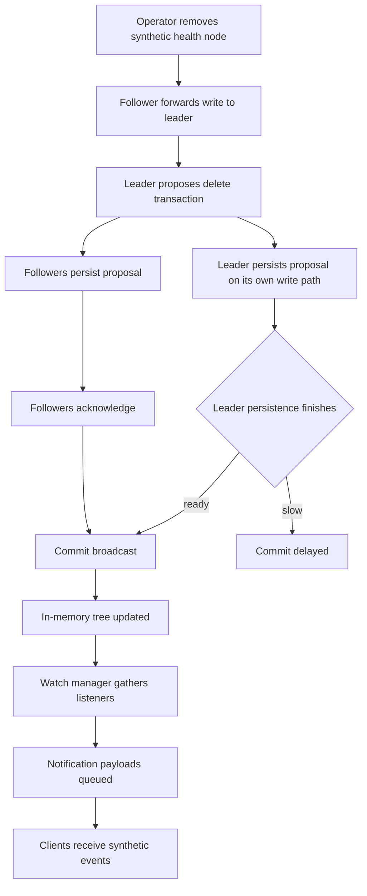
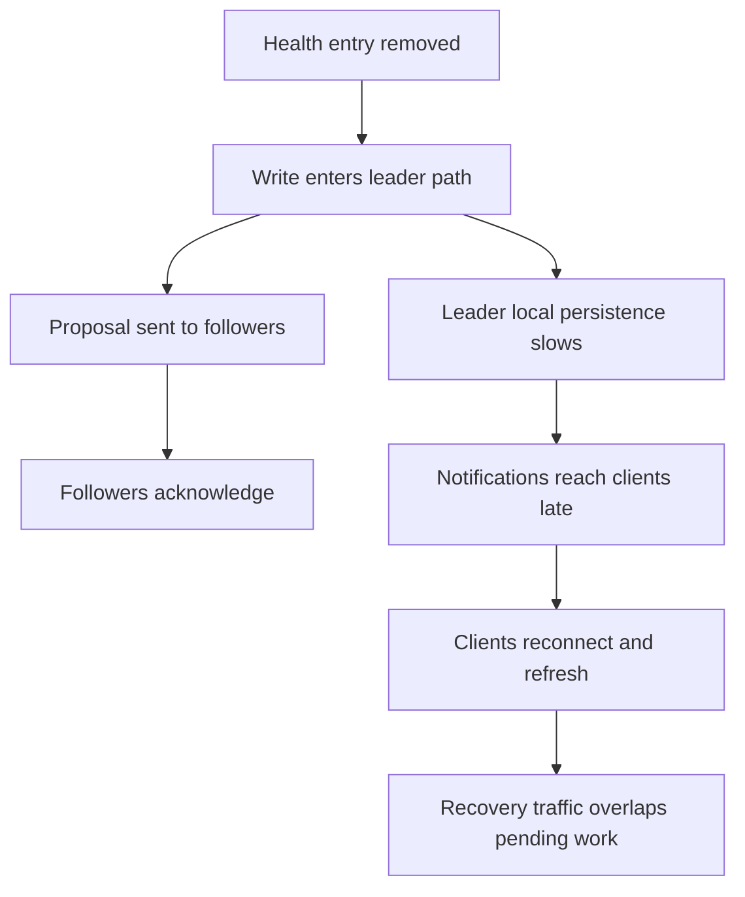

# Coordination Service Incident Review

This document is a desensitized fixture for repository publication. It preserves the markdown feature mix needed by this repository while removing real dates, exact registry keys, internal identifiers, infrastructure counts, and measured incident values.

## Context

The system under discussion is a generic coordination service cluster used by many application clients across multiple zones. The cluster mixes different host profiles, different storage behaviors, and a client SDK that reconnects and rebuilds watches when sessions are lost.

This fixture is intentionally synthetic. It preserves long narrative text, tables, code blocks, mermaid diagrams, blockquotes, and path-like strings without exposing the original operational material.

## Sanitized Registry Layout

- Service metadata path: `/registry/services/<group>/<service>`
- Capability metadata path: `/registry/capabilities/<group>/<service>/<feature>`
- Presence path: `/registry/presence/<group>/<service>/<release>/<instance>`
- Health path: `/registry/health/<instance>`
- Route map path: `/registry/routes/<group>/<service>/<release>/<feature>/<channel>/<instance>`

> All registry keys shown here are synthetic placeholders. They represent structure only and do not match any internal production namespace.

## Sanitized Incident Summary

An operator removed a subset of health-related nodes from the registry tree while the cluster was already under sustained pressure. The client SDK did not react directly to those specific health-node deletions, but the coordination layer still had to serialize notifications, persist delete operations, and keep processing outstanding session work.

That first pressure wave was enough to push the system into stalled request processing. Once sessions began expiring, the cluster started deleting presence nodes owned by those sessions. Those deletions mattered because the SDK does react to presence-node changes: it rebuilds watches and refreshes registry content.

The result was a feedback loop:

- internal persistence slowed down
- request queues stopped draining
- sessions expired
- presence nodes were removed
- clients reconnected aggressively
- the cluster received even more read and watch traffic

## Sanitized Coordination Flow



## Sanitized Escalation Sequence



## Sanitized Feedback Loop


## Observed Symptoms

| Signal | Sanitized description |
| --- | --- |
| Write path | Commit latency became unstable and visibly spiky |
| Queue depth | Outstanding work stopped draining |
| Session health | Many clients lost sessions in a short interval |
| Client behavior | Recovery logic retried too aggressively |
| Network profile | Notification and refresh traffic overlapped |
| Recovery state | The cluster remained busy instead of converging |

## Simplified SDK Sketch

```python
def recover_registry_session(client, registry_root, watcher_factory):
    client.open_session()

    service_root = f"{registry_root}/services"
    presence_root = f"{registry_root}/presence"
    health_root = f"{registry_root}/health"

    client.watch_children(service_root, watcher_factory("service-root"))
    client.watch_children(presence_root, watcher_factory("presence-root"))
    client.watch_children(health_root, watcher_factory("health-root"))

    for child_path in client.list_children(service_root):
        client.watch_data(child_path, watcher_factory("service-data"))

    for child_path in client.list_children(presence_root):
        client.watch_children(child_path, watcher_factory("presence-branch"))


    service_root = f"{registry_root}/services"
    presence_root = f"{registry_root}/presence"
    health_root = f"{registry_root}/health"

    client.watch_children(service_root, watcher_factory("service-root"))
    client.watch_children(presence_root, watcher_factory("presence-root"))
    client.watch_children(health_root, watcher_factory("health-root"))

    for child_path in client.list_children(service_root):
        client.watch_data(child_path, watcher_factory("service-data"))

    for child_path in client.list_children(presence_root):
        client.watch_children(child_path, watcher_factory("presence-branch"))


    service_root = f"{registry_root}/services"
    presence_root = f"{registry_root}/presence"
    health_root = f"{registry_root}/health"

    client.watch_children(service_root, watcher_factory("service-root"))
    client.watch_children(presence_root, watcher_factory("presence-root"))
    client.watch_children(health_root, watcher_factory("health-root"))

    for child_path in client.list_children(service_root):
        client.watch_data(child_path, watcher_factory("service-data"))

    for child_path in client.list_children(presence_root):
        client.watch_children(child_path, watcher_factory("presence-branch"))


    service_root = f"{registry_root}/services"
    presence_root = f"{registry_root}/presence"
    health_root = f"{registry_root}/health"

    client.watch_children(service_root, watcher_factory("service-root"))
    client.watch_children(presence_root, watcher_factory("presence-root"))
    client.watch_children(health_root, watcher_factory("health-root"))

    for child_path in client.list_children(service_root):
        client.watch_data(child_path, watcher_factory("service-data"))

    for child_path in client.list_children(presence_root):
        client.watch_children(child_path, watcher_factory("presence-branch"))

    return "session-restored"
```

## Public-Safe Cluster Notes

- The cluster spans more than one failure domain.
- Different storage characteristics exist across zones.
- Most clients prefer one side of the topology.
- A large watch fan-out can be harmless at rest and dangerous during churn.
- A reconnect policy without strong backoff can amplify failure instead of containing it.

## Practical Takeaways

- Treat shared persistence latency as a first-class risk in coordination systems.
- Separate synthetic publication fixtures from internal postmortem material.
- Prefer generic registry keys in public examples.
- Keep recovery behavior conservative under systemic stress.
- Validate cluster safety with queue drain rate, session churn, watch fan-out, and reconnect policy together rather than with a single capacity number.
